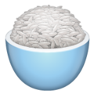

# Example columns

:::::::::::::: {.columns align="center"}
::: {.column width="0.4"}

{height=30mm}

\vspace{2ex}

{height=30mm}

:::
::: {.column width="0.6"}

- text here
- tasty rice

:::
::::::::::::::

::: notes
\tiny
- notes go here
:::
